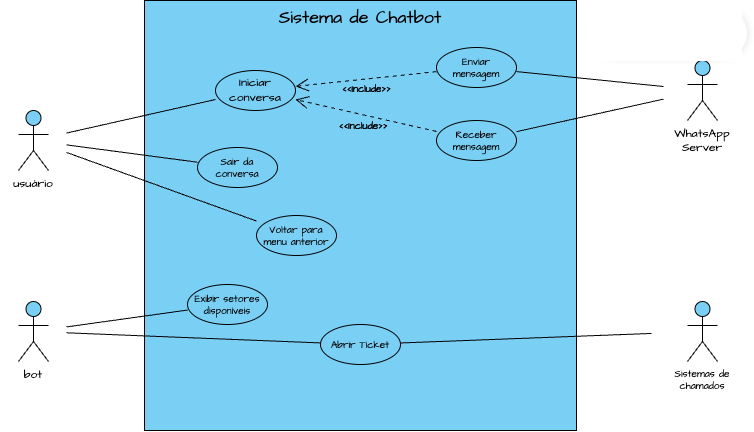
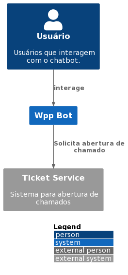
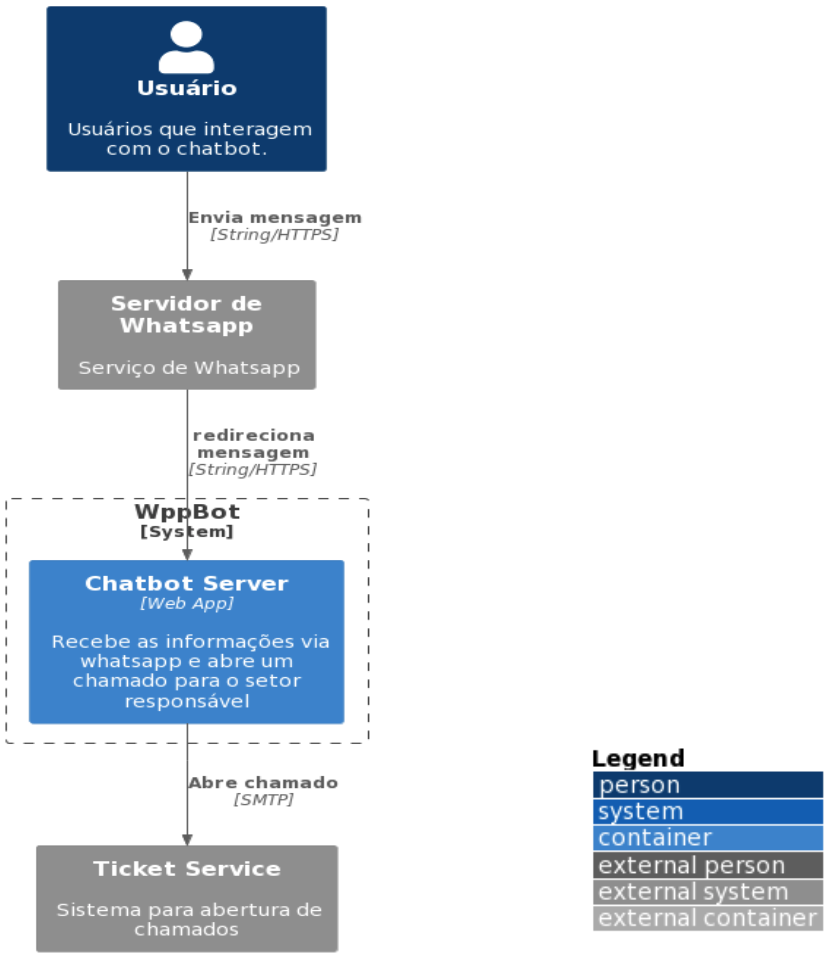
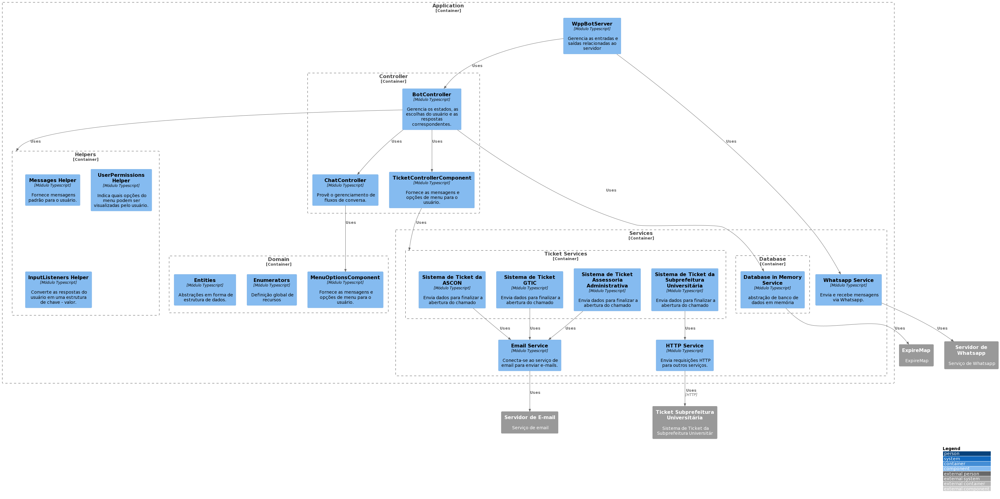
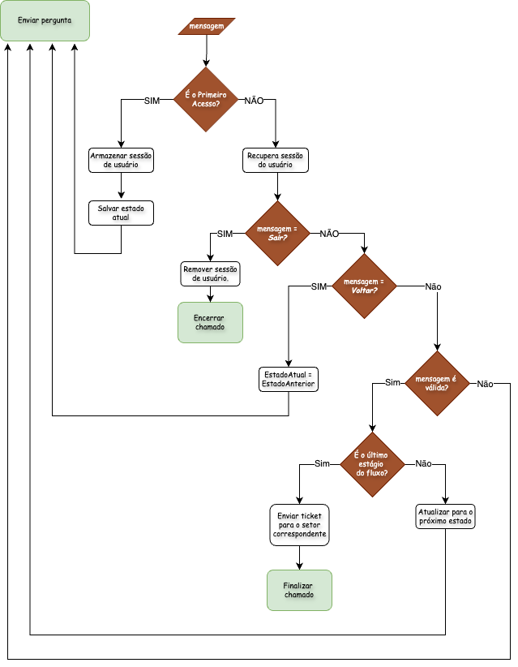
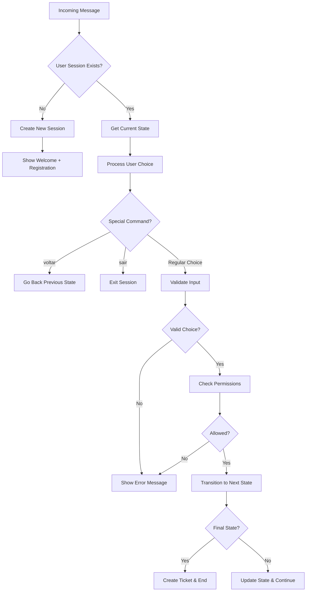

# Architecture

## Use Cases



## C3 Model

### C1



### C2



### C3



## Architecture Decisions

### **State Management**

- **Decision**: Use in-memory storage with TTL
- **Rationale**: Fast access, automatic cleanup, suitable for session data
- **Trade-off**: Limited to single instance, data lost on restart

### **Conversation Flow**

- **Decision**: State machine pattern
- **Rationale**: Predictable flows, easy testing, maintainable
- **Trade-off**: More complex initial setup

### **Department Integration**

- **Decision**: Hybrid approach (Email + HTTP)
- **Rationale**: Adapts to existing department systems
- **Trade-off**: Multiple integration patterns to maintain

### **Permission System**

- **Decision**: Role-based access control
- **Rationale**: Different user types need different access levels
- **Trade-off**: Additional complexity in menu rendering

### **WhatsApp Integration**

- **Decision**: wppconnect library
- **Rationale**: Mature, well-maintained, feature-rich
- **Trade-off**: Dependency on external library updates

# Bot Controller Architecture

## Overview

The **Bot Controller** is the central orchestrator of the WhatsApp bot system. It acts as the main entry point for processing user messages and managing the entire conversation flow. The controller implements a sophisticated state machine pattern to handle complex multi-step conversations while maintaining user context and managing permissions.



## Core Components

### 1. **Main Bot Controller Function**

```typescript
export function botController(user: ChatUser): string;
```

The main function that processes every incoming message and returns the appropriate response.

### 2. **Session Management**

- **InMemoryDatabase**: Uses `expiry-map` library for automatic session cleanup (20 minutes)
- **ActiveUsers**: Tracks user sessions with conversation state and ticket data
- **Session Persistence**: Maintains user progress across multiple interactions

### 3. **State Machine**

- **State Interface**: Defines conversation flow structure
- **State Transitions**: Each state can transition to the next based on user input
- **State Stack**: Maintains history for "go back" functionality

## How It Works

### 1. **Message Processing Flow**



### 2. **Session Lifecycle**

#### **Session Creation** (`handleInitialPayload`)

```typescript
const handleInitialPayload = (user: ChatUser) => {
  const state = InitialState; // FullNameState (registration)

  const payload: ActiveUsers["payload"] = {
    createdAt: new Date(),
    ticket: {}, // Empty ticket data
    currentState: state, // Current conversation state
    previousStates: [], // Stack for navigation
  };

  activeUsers.set(user.phoneNumber, { payload });
  return state;
};
```

#### **State Navigation** (`handleGoBack`)

```typescript
const handleGoBack = (
  user: ChatUser,
  activeUser: ActiveUsers,
  isFirstStage: boolean
) => {
  const previousState = isFirstStage
    ? activeUser.payload.currentState // Stay in current if first stage
    : activeUser.payload.previousStates.pop(); // Pop from stack

  // Update session with previous state
  const payload = { ...activeUser.payload, currentState: previousState };
  activeUsers.set(user.phoneNumber, { payload });
  return previousState;
};
```

#### **State Updates** (`handleUpdateState`)

```typescript
const handleUpdateState = (
  user: ChatUser,
  activeUser: ActiveUsers,
  ticket: Request,
  nextState: State
) => {
  // Push current state to history stack
  activeUser.payload.previousStates.push(activeUser.payload.currentState);

  const payload: ActiveUsers["payload"] = {
    ...activeUser.payload,
    ticket, // Updated ticket data
    currentState: nextState, // New current state
  };

  activeUsers.set(user.phoneNumber, { payload });
};
```

### 3. **Ticket Building Process** (`buildTicket`)

The controller progressively builds ticket data by extracting information from user inputs:

```typescript
const buildTicket = (
  choice: string,
  ticketData: Request,
  currentState: State
): Request => {
  // Extract data based on current menu context
  const {
    user: inputListenerUser,
    destination: inputListenerDestination,
    information: inputListenerInformation,
    ...rest
  } = inputListener(currentState.menu, choice);

  // Merge with existing ticket data
  return {
    ...ticketData,
    ...rest,
    user: { ...ticketData.user, ...inputListenerUser },
    destination: { ...ticketData.destination, ...inputListenerDestination },
    information: { ...ticketData.information, ...inputListenerInformation },
  };
};
```

### 4. **Permission System**

The controller enforces user permissions based on user type (Student vs Other):

```typescript
const _isAllowedOption = isAllowedOption(
  currentState.menu.className, // Current menu context
  userType, // User's type (Student/Other)
  choice // User's choice
);

if (!_isAllowedOption)
  return wrongAnswerMessage(generateMenu(currentState.menu));
```

### 5. **State Machine Logic**

#### **State Structure**

```typescript
type State = {
  type?: "service" | "information"; // Type of state
  menu?: MenuOptions; // Menu to display
  next?: (choice: string, ticket?: any) => State; // Transition function
  answer?: (choice: string) => string; // Final answer function
};
```

#### **State Transitions**

Each state defines its own transition logic:

- **Menu States**: Present options and validate choices
- **Input States**: Collect free-text information
- **Service States**: Final states that create tickets
- **Information States**: Final states that provide information

### 6. **Error Handling**

The controller includes comprehensive error handling:

```typescript
try {
  // Main processing logic
} catch (error) {
  console.log({ error });
  return wrongAnswerMessage(generateMenu(currentState.menu));
}
```

## Key Features

### **Special Commands**

- **`voltar`** (go back): Navigate to previous state
- **`sair`** (exit): End conversation and clean session

### **Session Management**

- **Automatic Expiry**: Sessions expire after 20 minutes of inactivity
- **Memory Cleanup**: Automatic cleanup of expired sessions
- **State Persistence**: Users can resume where they left off

### **Permission Control**

- **User Type Based**: Different menu options for different user types
- **Dynamic Menus**: Menus adapt based on user permissions
- **Access Control**: Prevents unauthorized access to certain features

### **Ticket Processing**

- **Progressive Building**: Ticket data built incrementally through conversation
- **Validation**: Input validation at each step
- **Routing**: Automatic routing to appropriate departments

## Integration Points

### **Input Processing**

- **Input Listeners**: Extract structured data from user responses
- **Menu Generation**: Create formatted menus for WhatsApp display
- **Message Templates**: Standardized response messages

### **External Services**

- **Ticket Controller**: Creates tickets in external systems
- **Email Service**: Sends confirmations and notifications
- **WhatsApp Service**: Handles message sending/receiving

### **Database**

- **In-Memory Storage**: Fast session management with TTL
- **Expiry Map**: Automatic cleanup of old sessions
- **Thread-Safe**: Handles concurrent user sessions

## Flow Example

1. **User sends message** → Bot Controller receives `ChatUser` object
2. **Session check** → New user gets registration flow, existing user continues
3. **Input processing** → User choice is validated and processed
4. **Permission check** → Verify user can access requested option
5. **State transition** → Move to next conversation step
6. **Response generation** → Create appropriate WhatsApp message
7. **Session update** → Save progress and state for next interaction

This architecture provides a robust, scalable foundation for complex conversational workflows while maintaining clean separation of concerns and comprehensive error handling.
