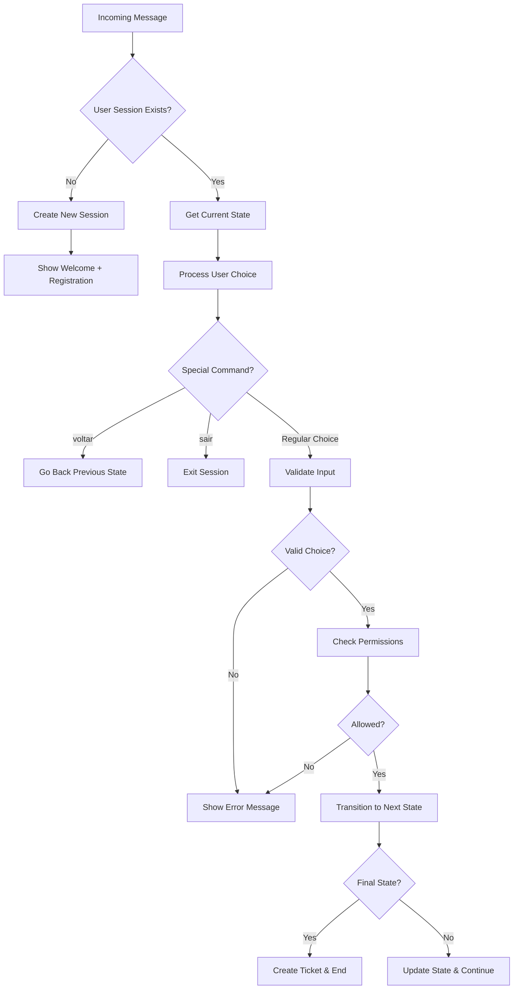
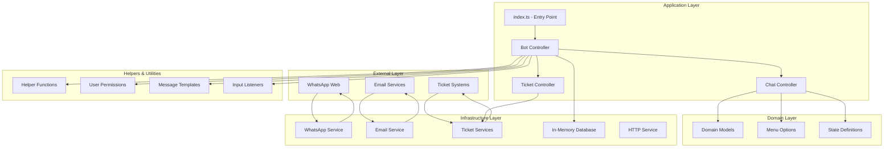

# WPP-Bot Project Architecture

## Architecture Decisions

### **State Management**
- **Decision**: Use in-memory storage with TTL
- **Rationale**: Fast access, automatic cleanup, suitable for session data
- **Trade-off**: Limited to single instance, data lost on restart

### **Conversation Flow**
- **Decision**: State machine pattern
- **Rationale**: Predictable flows, easy testing, maintainable
- **Trade-off**: More complex initial setup

### **Department Integration**
- **Decision**: Hybrid approach (Email + HTTP)
- **Rationale**: Adapts to existing department systems
- **Trade-off**: Multiple integration patterns to maintain

### **Permission System**
- **Decision**: Role-based access control
- **Rationale**: Different user types need different access levels
- **Trade-off**: Additional complexity in menu rendering

### **WhatsApp Integration**
- **Decision**: wppconnect library
- **Rationale**: Mature, well-maintained, feature-rich
- **Trade-off**: Dependency on external library updates

# Bot Controller Architecture

## Overview

The **Bot Controller** is the central orchestrator of the WhatsApp bot system. It acts as the main entry point for processing user messages and managing the entire conversation flow. The controller implements a sophisticated state machine pattern to handle complex multi-step conversations while maintaining user context and managing permissions.

## Core Components

### 1. **Main Bot Controller Function**
```typescript
export function botController(user: ChatUser): string
```

The main function that processes every incoming message and returns the appropriate response.

### 2. **Session Management**
- **InMemoryDatabase**: Uses `expiry-map` library for automatic session cleanup (20 minutes)
- **ActiveUsers**: Tracks user sessions with conversation state and ticket data
- **Session Persistence**: Maintains user progress across multiple interactions

### 3. **State Machine**
- **State Interface**: Defines conversation flow structure
- **State Transitions**: Each state can transition to the next based on user input
- **State Stack**: Maintains history for "go back" functionality

## How It Works

### 1. **Message Processing Flow**



### 2. **Session Lifecycle**

#### **Session Creation** (`handleInitialPayload`)
```typescript
const handleInitialPayload = (user: ChatUser) => {
  const state = InitialState; // FullNameState (registration)
  
  const payload: ActiveUsers["payload"] = {
    createdAt: new Date(),
    ticket: {},                    // Empty ticket data
    currentState: state,           // Current conversation state
    previousStates: [],            // Stack for navigation
  };
  
  activeUsers.set(user.phoneNumber, { payload });
  return state;
};
```

#### **State Navigation** (`handleGoBack`)
```typescript
const handleGoBack = (user: ChatUser, activeUser: ActiveUsers, isFirstStage: boolean) => {
  const previousState = isFirstStage
    ? activeUser.payload.currentState    // Stay in current if first stage
    : activeUser.payload.previousStates.pop(); // Pop from stack
    
  // Update session with previous state
  const payload = { ...activeUser.payload, currentState: previousState };
  activeUsers.set(user.phoneNumber, { payload });
  return previousState;
};
```

#### **State Updates** (`handleUpdateState`)
```typescript
const handleUpdateState = (user: ChatUser, activeUser: ActiveUsers, ticket: Request, nextState: State) => {
  // Push current state to history stack
  activeUser.payload.previousStates.push(activeUser.payload.currentState);
  
  const payload: ActiveUsers["payload"] = {
    ...activeUser.payload,
    ticket,                        // Updated ticket data
    currentState: nextState,       // New current state
  };
  
  activeUsers.set(user.phoneNumber, { payload });
};
```

### 3. **Ticket Building Process** (`buildTicket`)

The controller progressively builds ticket data by extracting information from user inputs:

```typescript
const buildTicket = (choice: string, ticketData: Request, currentState: State): Request => {
  // Extract data based on current menu context
  const {
    user: inputListenerUser,
    destination: inputListenerDestination,
    information: inputListenerInformation,
    ...rest
  } = inputListener(currentState.menu, choice);

  // Merge with existing ticket data
  return {
    ...ticketData,
    ...rest,
    user: { ...ticketData.user, ...inputListenerUser },
    destination: { ...ticketData.destination, ...inputListenerDestination },
    information: { ...ticketData.information, ...inputListenerInformation },
  };
};
```

### 4. **Permission System**

The controller enforces user permissions based on user type (Student vs Other):

```typescript
const _isAllowedOption = isAllowedOption(
  currentState.menu.className,    // Current menu context
  userType,                       // User's type (Student/Other)
  choice                          // User's choice
);

if (!_isAllowedOption)
  return wrongAnswerMessage(generateMenu(currentState.menu));
```

### 5. **State Machine Logic**

#### **State Structure**
```typescript
type State = {
  type?: "service" | "information";     // Type of state
  menu?: MenuOptions;                   // Menu to display
  next?: (choice: string, ticket?: any) => State;  // Transition function
  answer?: (choice: string) => string;  // Final answer function
};
```

#### **State Transitions**
Each state defines its own transition logic:
- **Menu States**: Present options and validate choices
- **Input States**: Collect free-text information
- **Service States**: Final states that create tickets
- **Information States**: Final states that provide information

### 6. **Error Handling**

The controller includes comprehensive error handling:

```typescript
try {
  // Main processing logic
} catch (error) {
  console.log({ error });
  return wrongAnswerMessage(generateMenu(currentState.menu));
}
```

## Key Features

### **Special Commands**
- **`voltar`** (go back): Navigate to previous state
- **`sair`** (exit): End conversation and clean session

### **Session Management**
- **Automatic Expiry**: Sessions expire after 20 minutes of inactivity
- **Memory Cleanup**: Automatic cleanup of expired sessions
- **State Persistence**: Users can resume where they left off

### **Permission Control**
- **User Type Based**: Different menu options for different user types
- **Dynamic Menus**: Menus adapt based on user permissions
- **Access Control**: Prevents unauthorized access to certain features

### **Ticket Processing**
- **Progressive Building**: Ticket data built incrementally through conversation
- **Validation**: Input validation at each step
- **Routing**: Automatic routing to appropriate departments

## Integration Points

### **Input Processing**
- **Input Listeners**: Extract structured data from user responses
- **Menu Generation**: Create formatted menus for WhatsApp display
- **Message Templates**: Standardized response messages

### **External Services**
- **Ticket Controller**: Creates tickets in external systems
- **Email Service**: Sends confirmations and notifications
- **WhatsApp Service**: Handles message sending/receiving

### **Database**
- **In-Memory Storage**: Fast session management with TTL
- **Expiry Map**: Automatic cleanup of old sessions
- **Thread-Safe**: Handles concurrent user sessions

## Flow Example

1. **User sends message** → Bot Controller receives `ChatUser` object
2. **Session check** → New user gets registration flow, existing user continues
3. **Input processing** → User choice is validated and processed
4. **Permission check** → Verify user can access requested option
5. **State transition** → Move to next conversation step
6. **Response generation** → Create appropriate WhatsApp message
7. **Session update** → Save progress and state for next interaction

This architecture provides a robust, scalable foundation for complex conversational workflows while maintaining clean separation of concerns and comprehensive error handling.

## Architecture Overview

The WPP-Bot project follows a **layered architecture** with clear separation of concerns, implementing **Domain-Driven Design (DDD)** principles and the **State Machine Pattern** for conversation management. The architecture is designed to be scalable, maintainable, and testable.

## Architecture Diagram



## Layer Description

### 1. **Application Layer** 
*Controllers and orchestration logic*

#### **Entry Point (`src/index.ts`)**
- Application bootstrap
- WhatsApp client initialization
- Message routing to Bot Controller

```typescript
// Main application flow
whatsappMessages.createServer()
  .then(handleClient)
  .catch(error => console.log({ error }));

function handleClient(client) {
  client.onMessage((message) => messageHandler(client, message));
}

function messageHandler(client, message) {
  const response = botController({
    phoneNumber: message.from,
    message: message.body,
  });
  
  if (response) {
    sendMessage(client, message.from, response);
  }
}
```

#### **Bot Controller (`src/controllers/bot-controller/`)**
- **Central orchestrator** of the entire system
- **Session management** with automatic expiry
- **State machine coordination**
- **Permission enforcement**
- **Error handling and recovery**

**Key Responsibilities:**
- Process incoming messages
- Manage user sessions (20-minute TTL)
- Coordinate state transitions
- Build ticket data progressively
- Enforce user permissions
- Handle special commands (`voltar`, `sair`)

#### **Chat Controller (`src/controllers/chat-controller/`)**
- **Conversation flow management**
- **State definitions** for each department
- **Multi-step workflow orchestration**

**Department-Specific Controllers:**
- `gtic/` - IT Department workflows
- `ascon/` - ASCON Department workflows  
- `administrative-consultancy/` - Admin workflows
- `university-town-hall/` - Maintenance workflows
- `sign-up/` - User registration flow
- `shared/` - Common workflow components

#### **Ticket Controller (`src/controllers/ticket-controller/`)**
- **Ticket creation orchestration**
- **Service routing** to appropriate departments
- **Integration with external systems**

### 2. **Domain Layer**
*Business logic and domain models*

#### **Domain Models (`src/domain/`)**
- **Core business entities** and types
- **Enums** for system constants
- **Domain interfaces** and contracts

```typescript
// Core domain types
export type ChatUser = { phoneNumber: string; message: string };

export type ActiveUsers = {
  payload: {
    createdAt: Date;
    ticket: Request;
    currentState: State;
    previousStates?: State[];
  };
};

export enum TicketDestination {
  Gtic = "gtic",
  Ascon = "ascon", 
  AdministrativeConsultancy = "administrative_consultancy",
  UniversityTownHall = "university_town_hall",
}
```

#### **Menu Options (`src/domain/menu-options/`)**
- **Conversation menu definitions**
- **Department-specific options**
- **Hierarchical menu structure**

**Menu Structure:**
```
menu-options/
├── index.ts              # Entry point menu
├── gtic/                 # IT Department menus
│   ├── internet/         # Internet access issues
│   ├── email-zimbra/     # Email services
│   ├── email-group/      # Group email management
│   ├── it-equipment/     # Equipment maintenance
│   ├── setup-and-installation/  # Software/hardware setup
│   └── it-management/    # IT management services
├── ascon/                # ASCON menus
├── administrative-consultancy/  # Admin consultancy menus
├── university-town-hall/ # University maintenance menus
├── sign-up/             # User registration menus
└── shared/              # Common menu components
```

### 3. **Infrastructure Layer**
*External integrations and technical services*

#### **WhatsApp Service (`src/services/whatsapp-messages/`)**
- **WhatsApp Web integration** using `@wppconnect-team/wppconnect`
- **Session management** for WhatsApp connection
- **Message sending/receiving**

```typescript
const wppconnect = require("@wppconnect-team/wppconnect");

export const createServer = async () => {
  const options = { session: "whatsbot", autoClose: false };
  return wppconnect.create(options);
};
```

#### **Email Service (`src/services/email/`)**
- **SMTP integration** using Nodemailer
- **Ticket confirmation emails**
- **Department notifications**

#### **Ticket Services (`src/services/tickets/`)**
- **Department-specific ticket creation**
- **Email-based tickets** (GTIC, ASCON, Admin)
- **HTTP-based tickets** (University Town Hall)

**Service Structure:**
```typescript
export const Ticket = {
  Gtic: GticTicket.getInstance(),
  Ascon: AsconTicket.getInstance(),
  AdministrativeConsultancy: AdministrativeConsultancyTicket.getInstance(),
  UniversityTownHall: UniversityTownHallTicket.getInstance(),
};
```

#### **Database Service (`src/services/database/in-memory/`)**
- **Session storage** using `expiry-map`
- **Automatic cleanup** of expired sessions
- **Thread-safe operations**

```typescript
export class InMemoryDatabase<Key = string, Value = any> {
  private db: ExpireMap<Key, Value>;
  
  constructor({ time }: MemoryDatabaseParams) {
    this.db = new ExpireMap<Key, Value>(time);
  }
  
  set(key: Key, value: Value) { this.db.set(key, value); }
  get(key: Key) { return this.db.get(key); }
  delete(key: Key) { this.db.delete(key); }
}
```

### 4. **Helpers & Utilities Layer**
*Cross-cutting concerns and utility functions*

#### **Input Listeners (`src/helpers/input-listeners/`)**
- **Input validation** and parsing
- **Data extraction** from user responses
- **Context-aware processing**

#### **User Permissions (`src/helpers/user-permissions/`)**
- **Role-based access control**
- **Permission enforcement**
- **Dynamic menu filtering**

```typescript
// Permission system
const permissions: Permissions = {
  [user[Student]]: studentPermissions,
  [user[Other]]: otherPermissions,
};

export const isAllowedOption = (routeName: string, userType: string, option: string) => {
  const deniedList = permissions[userType]?.denied[routeName] || [];
  return !deniedList.includes(option);
};
```

#### **Message Templates (`src/helpers/messages/`)**
- **Standardized message formats**
- **Welcome/error/confirmation messages**
- **Multi-language support preparation**

#### **Menu Generation (`src/helpers/`)**
- **Dynamic menu rendering**
- **WhatsApp-formatted menus**
- **Option numbering and formatting**

## Architectural Patterns

### 1. **State Machine Pattern**
Each conversation is managed as a state machine:

```typescript
export type State = {
  type?: "service" | "information";
  menu?: MenuOptions;
  next?: (choice: string, ticket?: any) => State;
  answer?: (choice: string) => string;
};
```

**Benefits:**
- **Predictable flows** - Each state defines valid transitions
- **Easy testing** - Each state can be tested independently
- **Maintainable** - Adding new flows is straightforward
- **Recoverable** - Users can navigate back through states

### 2. **Domain-Driven Design (DDD)**
- **Domain layer** contains business logic
- **Application layer** orchestrates use cases
- **Infrastructure layer** handles technical concerns
- **Clear boundaries** between layers

### 3. **Dependency Injection Pattern**
- **Service instances** injected into controllers
- **Configurable** through environment variables
- **Testable** with mock implementations

### 4. **Template Method Pattern**
- **Common workflows** defined in base classes
- **Department-specific** implementations
- **Consistent behavior** across different services

## Data Flow

### 1. **Message Processing Flow**
```
WhatsApp Message → WhatsApp Service → Bot Controller → Chat Controller → Domain Logic → Response Generation → WhatsApp Service → WhatsApp
```

### 2. **Session Management Flow**
```
User Message → Session Check → State Retrieval → Input Processing → State Transition → Session Update → Response
```

### 3. **Ticket Creation Flow**
```
Final State → Ticket Controller → Service Selection → External API/Email → Confirmation → Session Cleanup
```

## Configuration Management

### **Environment Variables (`config/`)**
- **Email configuration** - SMTP settings
- **Ticket destinations** - Department endpoints
- **Session timeouts** - Configurable TTL

```typescript
// Configuration structure
export const email = {
  host: process.env.HOST,
  port: process.env.PORT,
  secure: true,
  auth: {
    user: process.env.EMAIL_SENDER,
    pass: process.env.PASSWORD_EMAIL_SENDER
  }
};

export const ticket = {
  gtic: { email: process.env.GTIC_TICKET_EMAIL },
  ascon: { email: process.env.ASCON_TICKET_EMAIL },
  administrativeConsultancy: { email: process.env.ASSESSORIA_ADM_TICKET_EMAIL },
  universityTownHall: { url: process.env.UNIVERSITY_TOWN_HALL_URL },
};
```

## Testing Architecture

### **End-to-End Testing (`tests/e2e/`)**
- **Department workflows** - Complete user journeys
- **Permission scenarios** - Access control validation
- **Error conditions** - Failure handling
- **State transitions** - Flow validation

### **Test Structure**
```
tests/e2e/
├── administrative-consultancy/
├── ascon/
├── gtic/
│   ├── email-group/
│   ├── email-zimbra/
│   ├── it-equipments/
│   └── ...
└── university-town-hall/
```

## Scalability Considerations

### **Current Architecture Benefits**
- **Stateless services** - Easy horizontal scaling
- **Modular design** - Independent service scaling
- **Memory-efficient** - Automatic session cleanup
- **Concurrent handling** - Thread-safe operations

### **Future Scaling Options**
- **External database** - Replace in-memory with Redis/MongoDB
- **Message queues** - Asynchronous processing
- **Load balancing** - Multiple bot instances
- **Microservices** - Split by department

## Security Considerations

- **Session isolation** - User sessions are completely isolated
- **Input validation** - All user inputs are validated
- **Permission enforcement** - Role-based access control
- **Data cleanup** - Automatic session expiration
- **Environment secrets** - Sensitive data in environment variables

This architecture provides a robust, maintainable, and scalable foundation for the WhatsApp bot while maintaining clean separation of concerns and comprehensive error handling.